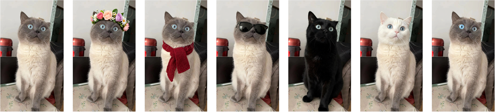
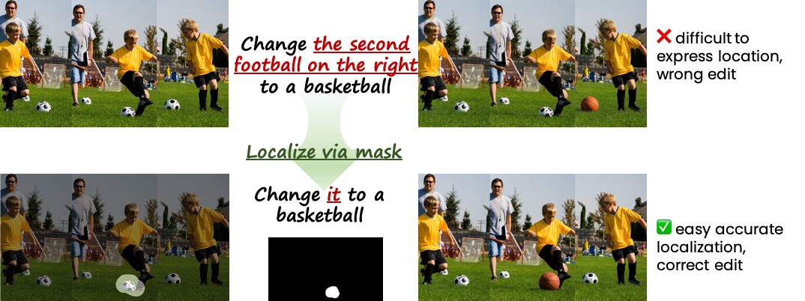
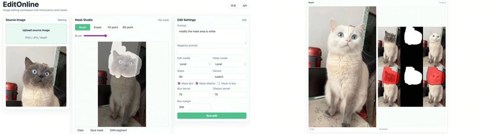

# 🪄 EditOnline
A WebUI for image editing, support mask-based and instruction-based editing.


## 🐈 Features

1. **MORE CONSISTENT** to use our pretrained LoRA.
2. Both local deployed model and API is supported.
3. Both instruction and mask editing is supported.
4. Design your own masks and save it.




## Quick Start

> Python 3.14, diffusers 0.37.1 and torch 2.10 are preferred.

- **Environment Configurations**: This project use [uv](https://docs.astral.sh/uv/getting-started/installation/) to build the environment. The configuration file have been provided, see `pyproject.toml` for more details. Run
```sh
uv sync
# Or uv sync --index-url other-source to enable synchronizing the environment from the specific source.
```
and the environment will be created in `.venv` by default. To modify the path of the environment, specify the env variable `UV_PROJECT_ENVIRONMENT` to your prefer path.


- **DiT and Pre-trained weights**: The base model is [QwenImage-Edit-2511](https://huggingface.co/Qwen/Qwen-Image-Edit-2511/tree/main), we provide a pre-trained LoRA for mask-based image editing. The weights will be released.

- To modify the path which the model will be loaded from, you can look [config](editonline/config.py) for more details.


- **External repo**: The mask generator depends to external repository, [SAM](https://github.com/facebookresearch/segment-anything.git) is used by default to generate more accurate mask. You add another segmentation models in `mask_generator/model_hub`.


- **🪄 START**: Just run
```sh
uv run uvicorn editonline.app:app --host 127.0.0.1 --port 8000
```
and the server will run locally on port `8000`, open the website and you will get the following panel:



Then you can upload your own image and draw/auto-segment/semi-segment a mask for localization, then tell the pipeline how to edit via an edit prompt on the right.

- <u>Draw a mask</u>: the panel support to draw a mask via mouse brush
- <u>Auto-segment</u>: invoke a segmentation model (default SAM) to generate a set of segmentations
- <u>Semi-segment</u>: modify a existing mask generated by model


## 🤓☝️ TODO

- [x] Release EditOnline framework
- [ ] Release mask-based editing LoRA weights
- [ ] Support API query

## 🤗 Contributors

- The mask generator part is finished by [@Shunzi Yang](https://github.com/Michael20070814)
